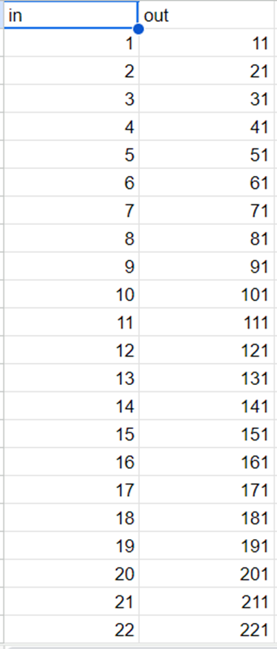
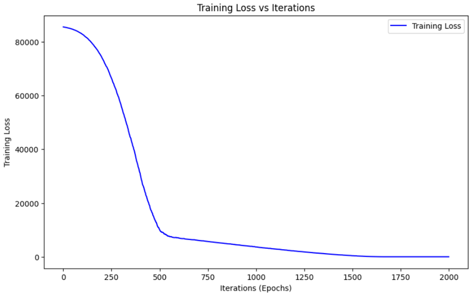
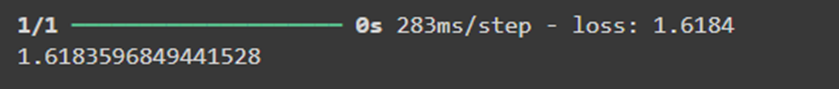
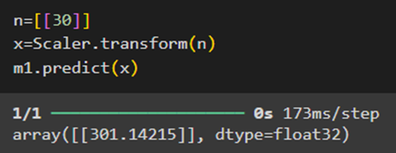

# Developing a Neural Network Regression Model

## AIM

To develop a neural network regression model for the given dataset.

## THEORY

Explain the problem statement

## Neural Network Model

Include the neural network model diagram.

## DESIGN STEPS

### STEP 1:

Loading the dataset

### STEP 2:

Split the dataset into training and testing

### STEP 3:

Create MinMaxScalar objects ,fit the model and transform the data.

### STEP 4:

Build the Neural Network Model and compile the model.

### STEP 5:

Train the model with the training data.

### STEP 6:

Plot the performance plot

### STEP 7:

Evaluate the model with the testing data.

## PROGRAM
### Name: Vismaya.S
### Register Number:212221230125
```python

from google.colab import auth
import gspread
from google.auth import default
import pandas as pd

auth.authenticate_user()
creds, _ = default()
gc = gspread.authorize(creds)

worksheet=gc.open('stdata').sheet1
data = worksheet.get_all_values()
df = pd.DataFrame(data[1:], columns=data[0])
print(df)

df=df.astype({'in':float,'out':float})
x=df[['in']].values
y=df[['out']].values

from sklearn.model_selection import train_test_split
x_train,x_test,y_train,y_test=train_test_split(x,y,test_size=0.33,random_state=33)

from sklearn.preprocessing import MinMaxScaler
Scaler=MinMaxScaler()
Scaler.fit(x_train)
x_train1=Scaler.transform(x_train)

from tensorflow.keras.models import Sequential
from tensorflow.keras.layers import Dense

m1=Sequential([
Dense(units=9,activation='relu',input_shape=[1]),
Dense(units=9,activation='relu'),
Dense(units=9,activation='relu'),
Dense(units=1)])

m1.summary()

m1.compile(optimizer='rmsprop',loss='mse')

m1.fit(x_train1,y_train,epochs=2000)

history=m1.history
import matplotlib.pyplot as plt
plt.figure(figsize=(10, 6))
plt.plot(history.history['loss'], label='Training Loss', color='blue')
plt.title('Training Loss vs Iterations')
plt.xlabel('Iterations (Epochs)')
plt.ylabel('Training Loss')

plt.legend()

plt.show()

xtrain1=Scaler.transform(x_test)
m1.evaluate(xtrain1,y_test)

n=[[30]]
x=Scaler.transform(n)
m1.predict(x)


```
## Dataset Information



## OUTPUT

### Training Loss Vs Iteration Plot



### Test Data Root Mean Squared Error


### New Sample Data Prediction


## RESULT

Include your result here
